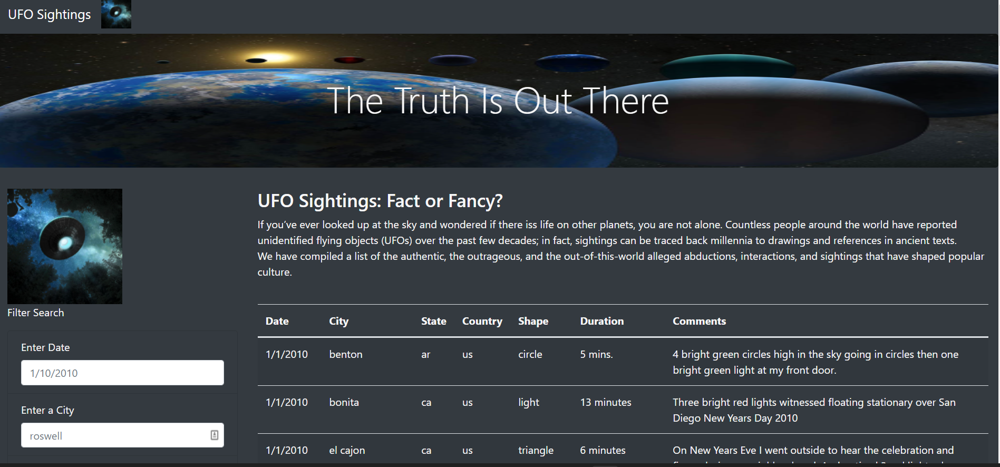
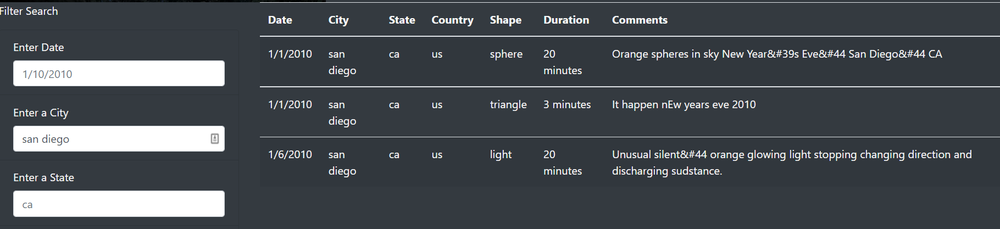
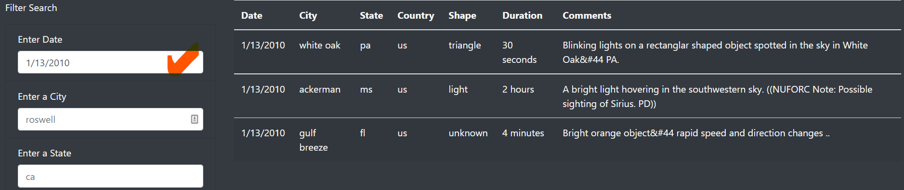

# UFO-JS

## **Overview of Project**

This project focuses on building a dynamic webpage that accepts user inputs and displays the filtered information about UFO sightings.
In order to perform their analysis, users will be able to filter the UFO sightings table based on five criteria: the event date, city, state, country and shape.

## **Results** 

Below is the main UFO sightings page. The user can re-initialize the page by clicking on the navbar "UFO Sightings" at the top.

#### Filtering by city

The user enters the desired city, the change is detected and the table is updated while keeping the other fields unfiltered.

#### Filtering by event date

## **Summary** 

The website provides minimal but useful functionality to the user. Future improvements: 

- I will add documentation that is readily available to users.
- Provide a drop-down of cities and other parameters for the user to know what choices are available. 
- 
  I will add a button to reset the dataset in a user-friendly accessible way. 